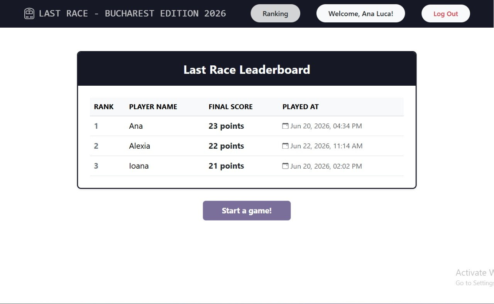
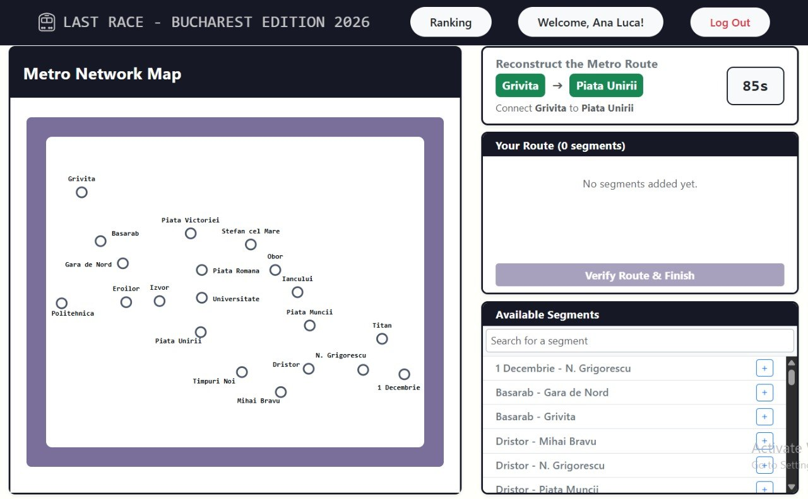

# Exam 1: "Last Race"
## Student: s354277 Mosneanu Isabela-Ioana

## React Client Application Routes

- Route `/`: Landing page showing the rules of the game to anyone
- Route `/login`: Login page - shows the user a login form
- Route `/userpage`: After logging in, the user will see the map with lines, a logout button and can also access the ranking through a button
- Route `/userpage/ranking`: The user can see the global ranking even though he played or not a game in the current session
- Route `/userpage/playgame`: The player can now see the map without lines or any other info and can enter a game where the timer will start and he'll chose the route
- Route  `/userpage/playgame/score/:segmentLength` : After finishing its game, the user will see the selected segments + random event + live score or game over + 0 points. The parameter segmentLength is the number of segments that the user selected and will be used to select the random events from the database

## API Server

  # Authentification and sessions
- POST `/api/sessions`: Authenticates a user using passport-local
  - request parameters: none
  - request body: `{ username: "email", password: "password"}` -> example: {username: "ana@gmail.com", password: "..."}
  - response: `201 Created` with the authenticated user object `{ id, email, name, surname }` or `401 Unauthorized`.

- GET `/api/sessions/current`: Checks if the current request is authenticated
  - request parameters: none
  - response: `200 OK` with the active user object or `401 Unauthorized` if no session exists

- DELETE `/api/sessions/current`: Destroys the current user session (Log Out)
  - parameters: none
  - response: `200 OK` (ends the response)

  # Metro map and data
- GET `/api/stations`: Retrieves the entire underground structural grid. (secured with `isLoggedIn`)
  - request parameters: none
  - response: `200 OK` with `{ stations: [...], connections: [...] }` or `500 Internal Server Error`.

  # Game engine
- GET `/api/game/start`: Fetches the core map data and generates a randomized pair of target stations for a new game session (secured with `isLoggedIn`)
  - requested parameters: none
  - response: `200 OK` with `{ startStation: {id,name, coordX, coordY} , endStation: {id,name, coordX, coordY} }`

- GET `/api/game/start/segments`: Collects all bidirectional connection segments available for selection (used for the "Available segments" list) (secured with `isLoggedIn`)
  - requested parameters: none
  - response: `200 OK` with an array of text strings representing tracks

- POST `/api/events`: Returns a sequence of random event based on the length of the constructed path (secured with `isLoggedIn`)
  - request parameters: none
  - request body: `{ numberOfEvents: 5 }`
  - response: `200 OK` with an array of event objects `{ id, description, effect }`

- POST `/api/game/verify`: Validates the user's selected path from start to finish (secured with `isLoggedIn`)
  - request parameters: none
  - request body: `{ chosenRoute: [...], startStation: "Name", endStation: "Name" }`
  - response: `200 OK` with `{ isValid: true }` or `{ isValid: false, message: "Error reason" }`.

  # Leaderboard and Ranking
- POST `/api/ranking`: Saves a new valid high score record to the database (secured with `isLoggedIn`)
  - request parameters: none
  - request body: `{ userId: 1, score: 35, date: "ISO-Timestamp" }`
  - response: `200 OK` with the database operation result confirmation wrapper.

- GET `/api/ranking`: Aggregates and returns the leaderboard positions, limited strictly to the single highest score per unique user (secured with `isLoggedIn`)
  - requested parameters: none
  - response: `200 OK` with an array of sorted entries `{ user_id, score, played_at, username }`.

## Database Tables

- Table `users` - contains id, email, hashed_password, salt, name, surname
- Table `stations` - contains id, name, x_coordinate, y_coordinate
- Table `lines` - contains id, name, color
- Table `games` - contains id, user_id, score, played_at
- Table `events` - contains id, description, effect
- Table `connections` - contains id, id_start_station, id_end_station, line_id

## Main React Components

- `MetroMap` (in `Map.jsx`): 
  - The graphics engine that draws the Bucharest subway map using simple circles for stations and colored lines for tracks. It automatically hides certain details (like titles) depending on where it is placed and shifts station labels around so they don't overlap.

- `PlayPage` (in `PlayPage.js`): 
  - The actual gameplay screen. It runs a 90-second countdown timer, lets you search and add/delete subway tracks to connect your starting station to your destination, and sends your path to the server for evaluation

- `RankingPage` (in `RankingPage.js`): The leaderboard page. It fetches a sorted list of the personal best scores from all players, displays them in a neat table from 1st place down, and gives you a purple "Back to Play" button to start over.

- `ScorePage` (in `ScorePage.js`): The "Game Over" screen. It displays sequentially your score and, if you failed the track layout, shows a clear message explaining the exact reason why the server declared your route invalid.

- `Userpage` (in `UserPage.js`): The first screen you see after logging in. It shows a clean preview of the map and a big purple PLAY button to start a new match.

## Screenshot

## Users Credentials

- email: ioana@gmail.com, password: ioana 
- email: ana@gmail.com, password: ana
- email: alexia@gmail.com, password: alexia 

## Use of AI Tools
Briefly describe whether you used any AI tools (e.g., ChatGPT, GitHub Copilot, Claude) while working on this project, for which purposes (e.g., clarifying concepts, debugging, generating code), and how you verified or adapted their output.
If you did not use any AI tools, simply state so.

I have used AI for this project. First, I have used AI to generate some rules for the "Last Race" game. 
To save time, AI generated me the SQL scripts used to populate the database with real-world station and connection matrices.
As this was my first time working with SVG elements in React, I used AI to clarify core vector concepts (such as coordinate mapping, textAnchor, and label offsets). This helped me handle complex graphic alignments and significantly improved the visual clarity of the Bucharest subway network map.
I am not a very CSS-person, but I like things to look good and clean, so I have used some AI to make the interface more user-friendly.
Finally, there were moments when I got some errors that I didn't even know were possible, so I consulted AI to diagnose the underlying root causes and implement solutions.